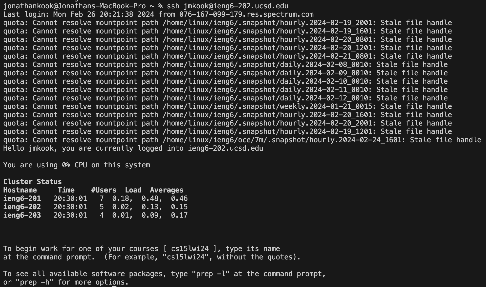
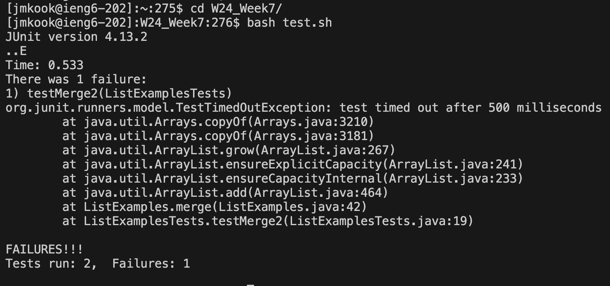
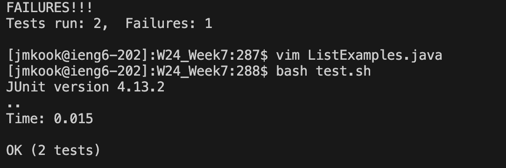
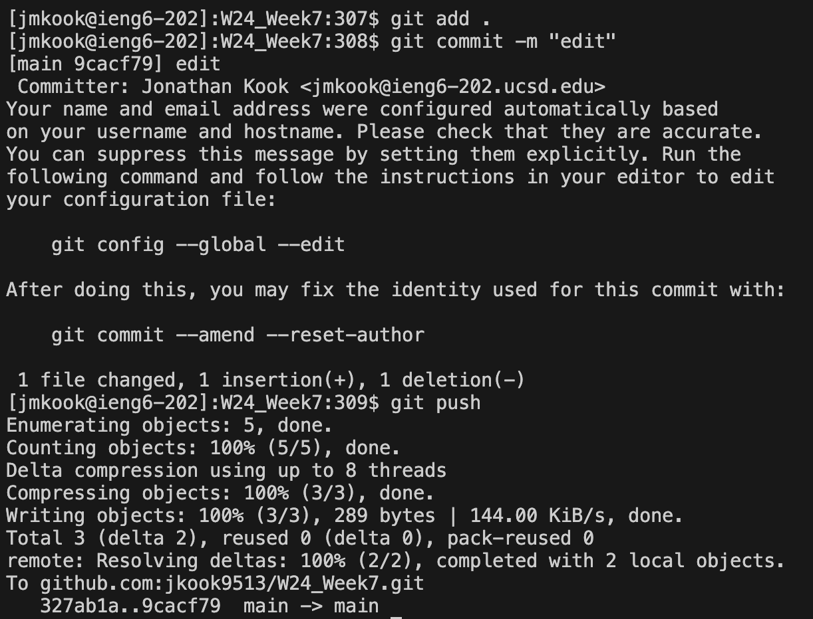

# Step 4 - Log into ieng6

* Keys pressed: `<up><enter>`. The command I ran was `ssh jmkook@ieng6-202.ucsd.edu`, which enables connection to the ieng6-202 server.

# Step 5 - Clone fork into repository from Github

* Keys pressed: `<up><up><up><up><up><up><up><up><up><up><up><enter>`. The command I ran was `git clone git@github.com:jkook9513/W24_Week7.git`, which clones the forked repository into my Github. The `<up>` key goes to the previous command typed, and since I used the `<up>` key 11 times, it goes back to the 11th most recently used command. The `<enter>` key executes the command. The `git clone git@github.com:jkook9513/W24_Week7.git` command was 11 up in the history, so I accessed and ran it.

# Step 6 - Run the tests, demonstrating that they fail

* Keys pressed: `<up><up><up><up><up><up><up><up><up><up><up><enter>` , `<up><up><up><up><up><up><up><up><up><up><up><enter>`. The commands I ran were `cd W24_Week7/` and `bash test.sh`. The first command is used to change the current directory to `W24_week7`, which I I just cloned into my Github. This step is necessary to run the bash command, since the test.sh file will not be found if the current directory is not changed first. The second command I ran is used to run the tests. The `<up>` key goes to the previous command typed, and since I used the `<up>` key 11 times, it goes back to the 11th most recently used command. The `<enter>` key executes the command. The `cd W24_Week7/` command was 11 up in the history, so I accessed and ran it. Then after executing that command, the `bash test.sh` command was 11 up in the history, so I accessed and ran it the same way.

# Step 7 - Edit the code file to fix the failing test

* Keys pressed: `<up><up><up><up><up><up><up><up><up><up><up><enter>` , `<G><up><up><up><up><up><up><2w><2h><r><2><:wq><enter>`. The command I ran was `vim ListExamples.java`, which is used to access the editor for the `ListExamples.java` file. The `vim ListExamples.java` command was 11 up in the history, so I accessed and ran it. The second code block is all the keys I used to edit the file. The `<G>` key makes the cursor jump to the bottom of the file. The `<up>` key moves the cursor up one line. `<2w>` makes the cursor jump to the start of the second word, and `<2h>` moves the cursor two characters to the left. The `<r>` key lets you replace the character at the cursor, and `<2>` is what I replaced the character with. `<:wq>` saves and exits the file after pressing `<enter>`.

# Step 8 - Run the tests, demonstrating that they now succeed

* Keys pressed: `<up><up><enter>`. The `<up>` key goes to the previous command typed, and since I used the `<up>` key 2 times, it goes back to the 2nd most recently used command. The `<enter>` key executes the command. The `bash test.sh` command was only 2 up in history, so I accessed and ran it.

# Step 9 - Commit and push the resulting change to Github account

* Keys pressed: `<up><up><up><up><up><up><up><up><up><up><up><enter>` , `<up><up><up><up><up><up><up><up><up><up><up><enter>` , `<up><up><up><up><up><up><up><up><up><up><up><enter>`. The three commands I ran were `git add .`, `git commit -m "edit"`, and `git push`. These three commands add the changes, commit the changes, and then push the changes to Github. The `<up>` key goes to the previous command typed, and since I used the `<up>` key 11 times, it goes back to the 11th most recently used command. The `<enter>` key executes the command. The `git add .` command was 11 up in the history, so I accessed and ran it. Then after executing that command, the `git commit -m "edit"` command was 11 up in the history, so I accessed and ran it the same way. Then after executing that command, the `git push` command was 11 up in the history, so I accessed and ran it the same way.
